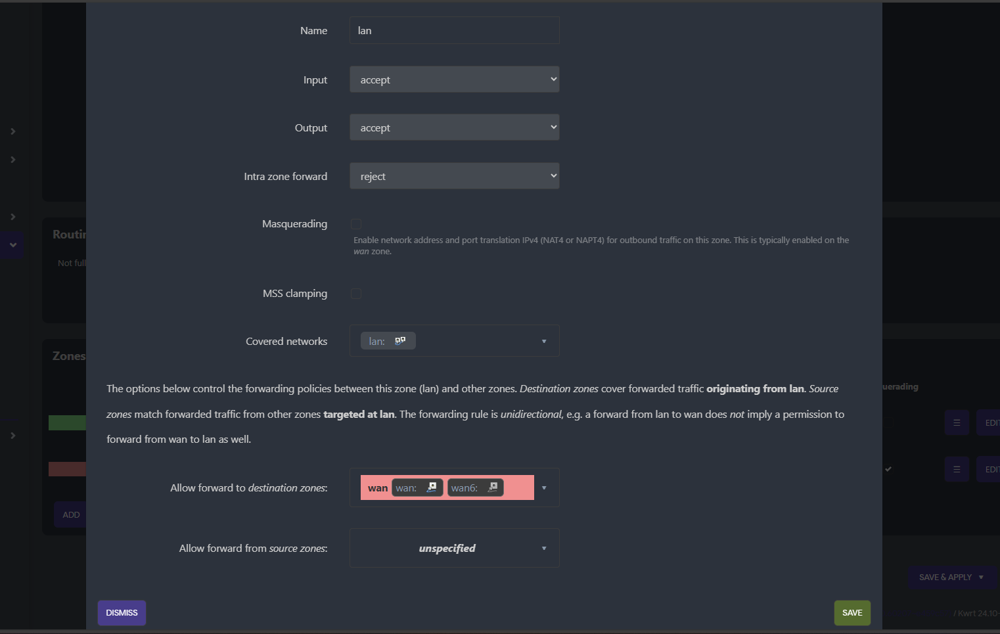
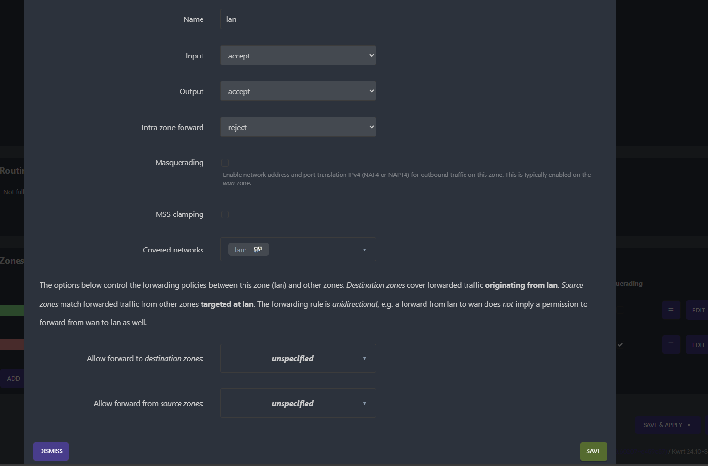

# 🔔 Auto Notifier for OpenWrt


This project automates MAC-based network access control on OpenWrt routers using Telegram Bot notifications. Devices can be allowed, denied, or restored via Telegram commands, with real-time firewall rule updates.

## 🚀 Features

- ✅ Allow or deny devices by MAC address via Telegram commands
- 🔄 Auto-sync firewall rules for `allow`, `deny`, and `RBlacklist`
- 📥 Automatically download and install required scripts and dependencies
- 🔄 Runs continuously in background using `cron` and `rc.local`

## ⚠️ Important Firewall Warning

To ensure the script functions correctly, you **must edit the OpenWrt firewall settings**:

1. Go to **Network → Firewall**.
2. Edit the **LAN zone**.
3. Under **Allow forward to destination zones**, **remove `wan`**.
4. Click **Save & Apply**.

📷 Example screenshots:

- Before editing:

  

- After editing:

  

If not configured properly,  Denied devices will not be blacklisted from geting internet access.

---

## 🛠 Requirements

|        Must Have These              |      Resaons                            |
|-------------------------------------|-----------------------------------------|
| `OpenWrt router`                    | To run the script                       |
| `Telegram bot token and chat ID`    | To send the notifications               |
| `Internet connectivity`             | To be able to send the notifications    |


## 📦 Installation

Run the following command in your terminal to install:

```bash
wget https://raw.githubusercontent.com/mdhasankhan5512/auto-notifier/refs/heads/main/setup_notifier.sh && chmod +x setup_notifier.sh && sh setup_notifier.sh
```

## 💬 Telegram Commands Format

| Command Format                     | Description                                 |
|-----------------------------------|---------------------------------------------|
| `/allow-MAC-IP-Name`              | Allow internet access for the device        |
| `/deny-MAC-IP-Name`               | Deny access and blacklist the MAC           |
| `/RBlacklist-MAC-IP-Name`         | Remove MAC from blacklist and re-allow      |

### 🔍 Example

```text
/allow-11:22:33:44:55:66-192.168.1.100-JohnsPhone
```

## 📃 License

This project is licensed under a **Creditware License** (a modified MIT License).  
> You may use, modify, or distribute this project freely **only if credit is clearly given to the original author**.

See [LICENSE](./LICENSE.md) for details.


## Disclaimer

**Note:** If your Wi-Fi drops, your snack disappears, and your cat walks across your keyboard causing chaos — I’m not to blame. You’re officially on your own! 🐱💻😂


## 👤 Author

This program was written by [Md Hasan Khan](https://www.facebook.com/hasan2unknown).


